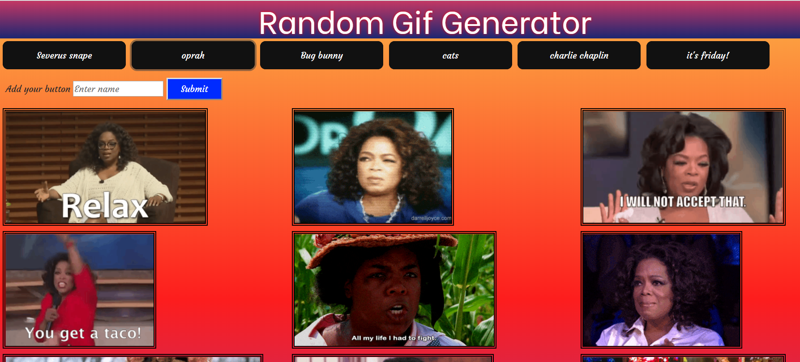

# TV Celeb Gif Generator
---

###### This is a fun project done as a part of homework project for Georgia Tech Full Stack Web Development Bootcamp. It is developed using `HTML`,`Javascript`,`CSS` and [Giphy API](https://giphy.com/). 

### Giphy API
---
Giphy is an online database and search engine that allows users to search for and share short looping videos with no sound, that resemble animated GIF files.For details please check [Giphy API documentaion](https://developers.giphy.com/docs/sdk).
Following are some emoji's from [Giphy.com](https://giphy.com).

### Instuctions
----
Theme for the project is famous television personalities , so you will see buttons from different catagories on the page.
Here is a snapshot of the page

(1) Click on any button shown on the page, related 10 gif's will be retrieved using Giphy API and will be displayed in the panel below buttons.
(2) If you wish to add your button, enter the category/person/theme name in the text box shown on page and click `Submit` button, a new button will be added to the page.

[Have fun with making gif's](https://pshegde123.github.io/GifTastic.github.io/)

